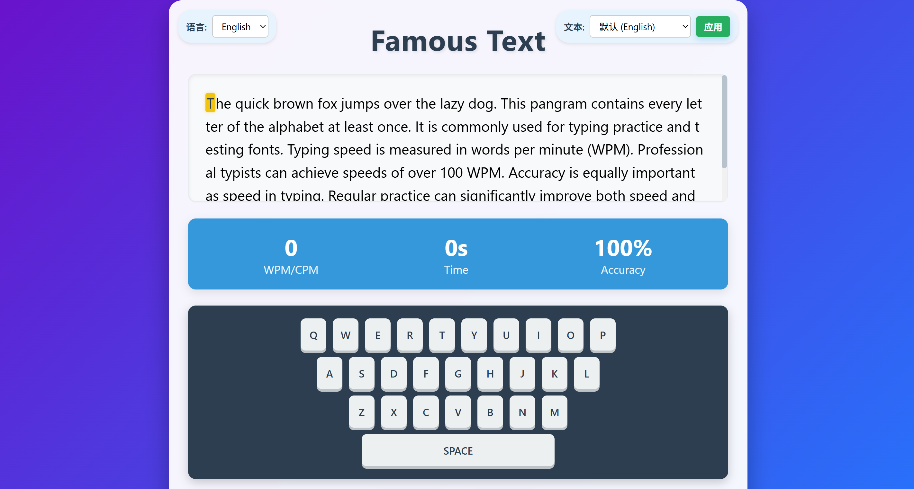

# Typing

一个美观且响应式的打字练习游戏，支持完整的中英文界面。通过各种文本类型（包括全字母句、成语和诗歌）测试并提高您的打字速度。

## ✨ 主要功能

- **多语言支持**: 英文和中文界面
- **多种文本类型**:
  - 英文: 默认文本、全字母句和乱数假文
  - 中文: 经典名言、成语和诗歌
  - 自定义文本选项
- **实时统计数据**:
  - 英文: 每分钟单词数(WPM)
  - 中文: 每分钟字符数(CPM)
  - 准确率百分比
  - 已用时间
- **视觉反馈**:
  - 颜色编码字符高亮(正确、当前、错误)
  - 带按键动画的虚拟键盘
- **特殊中文输入法支持**: 正确处理中文输入法
- **响应式设计**: 适用于桌面和移动设备

## 🖥️ 使用方法

### 在线演示
尝试游戏: [https://你的用户名.github.io/打字游戏/](https://你的用户名.github.io/打字游戏/)

### 本地设置
1. 克隆仓库:
   `git clone https://github.com/ZSliuzi/Typing.git`
2. 进入项目目录:
   `cd Typing`
3. 在浏览器中打开 `index.html`

无需服务器设置 - 这是一个静态HTML/CSS/JS应用程序，可以直接在浏览器中运行。

## 🎮 游戏说明

1. 从左上角下拉菜单选择您偏好的语言(英文或中文)
2. 从右上角下拉菜单选择文本类型:
- 英文: 默认、全字母句或乱数假文
- 中文: 默认名言、成语或诗歌
- 或输入自定义文本
3. 在文本区域开始打字
4. 游戏将自动:
- 将正确的字符标记为绿色
- 显示当前字符为黄色背景
- 将错误的字符标记为红色下划线
- 实时更新您的打字速度和准确率
5. 完成文本后，将显示您的结果

## 🛠️ 技术栈

- **HTML5**: 语义化结构和内容
- **CSS3**: 响应式设计，使用渐变、动画和弹性布局
- **JavaScript**: 游戏逻辑、事件处理和统计计算
- **特殊功能**:
  - 正确处理中文输入法
  - 虚拟键盘可视化
  - 平滑滚动和焦点管理

## 🤝 贡献指南

欢迎贡献! 以下是参与方式:

1. Fork 仓库
2. 创建您的功能分支 (`git checkout -b feature/AmazingFeature`)
3. 提交您的更改 (`git commit -m 'Add some AmazingFeature'`)
4. 推送到分支 (`git push origin feature/AmazingFeature`)
5. 打开 Pull Request

请确保更新适当的测试并保持一致的编码风格。

## 📄 许可证

本项目采用MIT许可证 - 详情请见[LICENSE](LICENSE)文件。

## 🙏 鸣谢

- 为打字爱好者精心设计 ❤️
- 感谢开源社区的灵感
